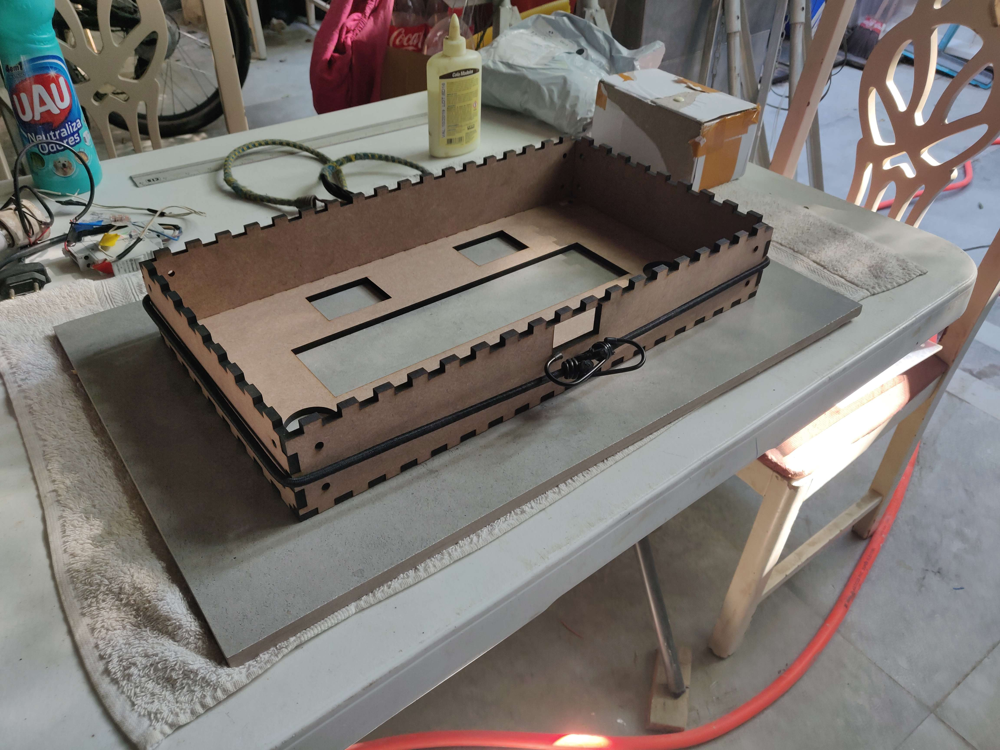
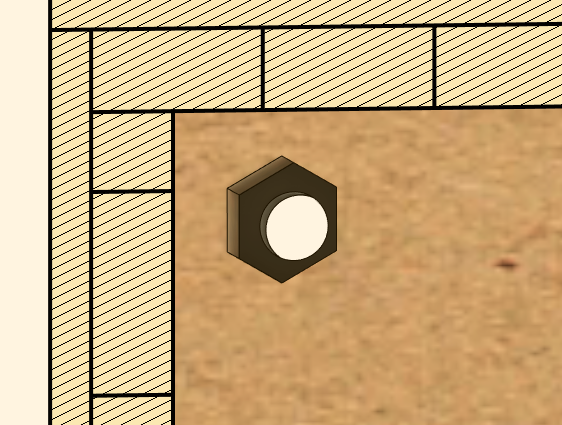
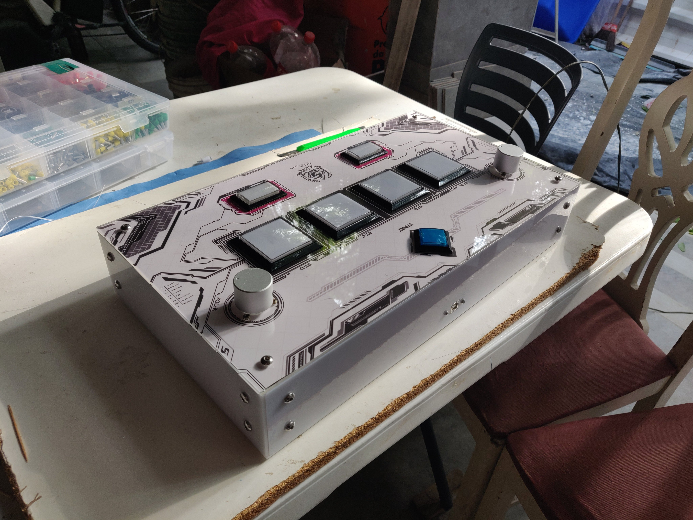

# Open SDVX Controller

This project contains case files, instructions and bill of materials for assembling a sound voltex controller that follows the arcade spec as closely as it is reasonable.

You should send the laser cut files (.dxf) for a laser cut service and ask for **3mm acrylic/plexiglass and 6mm MDF**
Files are named accordingly to avoid confusion.

There is also the original F3D file for fusion360 in case you want to make any changes, you're free to do whatever you want with it really lol.

---

## Assemblying the controller

While this specific project hasn't been assembled *yet* I have built another controller before, this project is supposed to fix its shortcomings

You might want to have the top acrylic plate as clear acrylic in case you want to put an artwork.

### Bill of materials:

Here is everything you need to buy. There are recommendations regarding switches/springs setups, [you should do your own research and choose what is best for you](https://rhythm-cons.wiki/w/Subjective_Thoughts_on_Switch_Choices_for_Controllers), I tried to keep within the consensus in the community.

As for laser cutting, some popular services are [sendcutsend](https://sendcutsend.com/) and [ponoko](https://www.ponoko.com/) but I encourage you to look locally.

- **Hardware**
    - x36 m5 screws that are 10~12mm long
    - x36 m5 flange nuts
- **Wiring**
    - [0.187" or 4.8mm crimp connectors (for buttons)](https://aliexpress.com/item/1005002334417636.html)
    - [0.250" or 6.3mm crimp connectors (for leds, 2 for each lamp)](https://aliexpress.com/item/1005002334417636.html)
    - [20 awg stranded wire (highly recommend buying 2 colors)](https://aliexpress.com/item/1005004200382009.html)
- **Encoders**
    - [2x Chinese Encoder](https://aliexpress.com/item/32669741048.htm)
- **Buttons**
    - [60*60 buttons (ABCD)](https://aliexpress.com/item/1005002359530037.html)
    - [50*33 buttons (FX-L & FX-R)](https://aliexpress.com/item/1005003157616433.html)
    - [33*33 button (Start)](https://aliexpress.com/item/32655406605.html)
- **Switches (Pick One)**
    - [7x Omron V-10-1A4 (Recommended, use with 20g springs)](https://aliexpress.com/item/1005004288217635.html)
    - [7x Omron D2MV-1C3 (Use with 60g springs)](https://istmall.co.kr/us/goods/goods_view.php?goodsNo=1009992804)
    - [7x Gersung switches (Use with 60g springs)](https://istmall.co.kr/us/goods/goods_view.php?goodsNo=1009992526)
- **Springs**
    - [7x Sanwa springs (recommended)](https://istmall.co.kr/us/goods/goods_view.php?goodsNo=1009992953)
    - [7x Generic Spring](https://istmall.co.kr/us/goods/goods_view.php?goodsNo=1009992332)
    - Highly recommend buying multiple springs of different weights so you dont have to do multiple orders
- **Knobs (Pick one, make sure you buy twice of the one you've picked)**
    - [2x Chinese Aluminum hi-fi Knob](https://aliexpress.com/item/32619270123.html)
    - [2x Speedylabs Arcade Knob](https://www.speedylabs.us/product/sound-voltex-aluminum-arcade-knob/)
    - [2x Speedylabs Yuancon Knob](https://www.speedylabs.us/product/sound-voltex-aluminum-yuancon-diy-knob/)
- **USB Connector**
    - [1x USB-B Panel mount connector](https://aliexpress.com/item/1005003288991552.html)
    - Make sure you buy one that has a cable that matches your pcb/microcontroller, otherwise you will need to strip the cable and solder the usb wires directly.
- **PCB**
    - [1x raspberry pi pico](https://aliexpress.com/item/1005004005660504.html)
    - [1x arduino leonardo](https://aliexpress.com/item/32834388225.html)
    - [1x arduino pro micro](https://aliexpress.com/item/32888212119.html)

### Assemblying the Case
You will need to glue together the MDF Pieces with finger joints. Spread glue around the finger joints and join them together. Make sure you use something to apply some pressure around the controller

After gluing all the wood faces together, let them dry for a day. After that you can start screwing in the acrylic plates around the controller.

The MDF faces have an Hex shaped hole, these will fit the m5 flange nuts. Insert the nut from the inside and screw in the acrylic plate from the outside.

Repeat this for all faces except the bottom one, the bottom one will be the last one.

### Electronics

Argueably the hardest part, its a lot of work but its not really complex. This will vary a bit depending on which firmware you pick, but the idea is generally the same.

The most important concept to learn is that whenever a button pin and a GND connect, that triggers a button press. When a button is pressed, it closes the contact between the pins.

Starting first from the ground wire, you will need to make sure every button and knob is connected to GND somehow, you can do it by daisy chaining the ground wire between everything, or you can break out from a single point into multiple ground wires. If you are handwiring your controller probably daisy chaining is the way to go.

You could use a protoboard and breakout multiple ground wires from there too, you can also use JST connectors if you are feeling adventurous.

For the encoders the wiring pinout is:
- Green: A phase or D+
- White: B phase or D-
- Red: VCC or 5V
- Black: V0 or GND

I recommend taking a look at [this video from Cons&Stuff](https://www.youtube.com/watch?v=ru6s4Ny8_0k&list=PL1-stUt4e92oJIEkfmvS2MhW4jPTuUhcC&index=2) to get an general idea on how to assemble the controller.
The idea of this project is very similar and can be adapted.

This video will cover how to install buttons properly and other stuff

### Firmware

You can opt for a raspberry pi pico which has a more powerful MCU, Arduinos are already estabilished and there are a bunch of premade code that can be used. Here are some recommendations:

- **Pi Pico**
    - [Pico-Game-Controller from Speedypotato](https://github.com/speedypotato/Pico-Game-Controller)
- **Arduino atmega32u4**
    - [RhythmCodes from Knuckleslee](https://github.com/knuckleslee/RhythmCodes)

Take a look at the git repo and see if you can find any information on the pinout used by the firmware, or take a look at the code.

You will probably need to adjust the sensitivity on your encoders depending on how many PPRs it has.

### Installing artwork

You will need to print a big enough art using the provided art template (or you can base yourself from the top acrylic plate file)

Place the acrylic plate on top of the atwork paper and with a x-acto knife or some sharp enough blade cut around the acrylic. Put your artwork underneath the acrylic and screw the top plate back again.

### Done

Your controller should look something like this:

Be aware that this picture is from the v1 of this controller so there are some differences.

If this has been helpful support me on ko-fi, good luck on building your controller!

